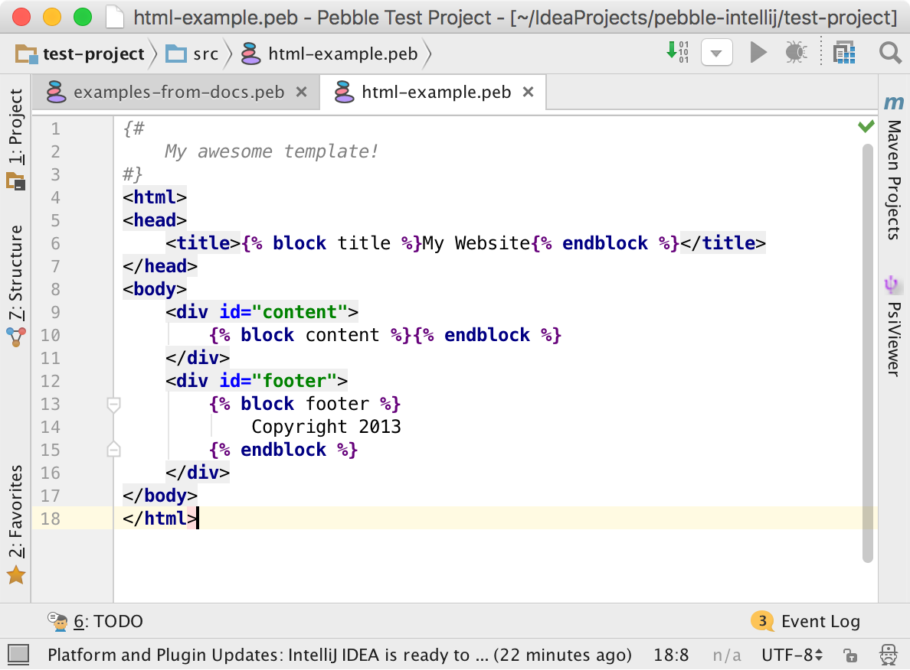

# IntelliJ plugin for Pebble

This plugin provides support for the 
[Pebble templating engine](https://github.com/PebbleTemplates/pebble) in 
IntelliJ-based IDEs, including IntelliJ IDEA Community Edition.

## Features

* parser/lexer1 and syntax highlighter
* braces matching, code folding and commenting
* quote handler
* more to come

1: *Custom extensions (tags, operators...), `verbatim` tags
and custom delimiters are currently not supported*.

## Mixing Pebble and other languages

To make the editor recognize two languages in the same file, for example HTML 
and Pebble, go to `Preferences > Languages & Frameworks > Template Data Languages`
and select the `HTML` data language on the directory that contains your Pebble
templates:

