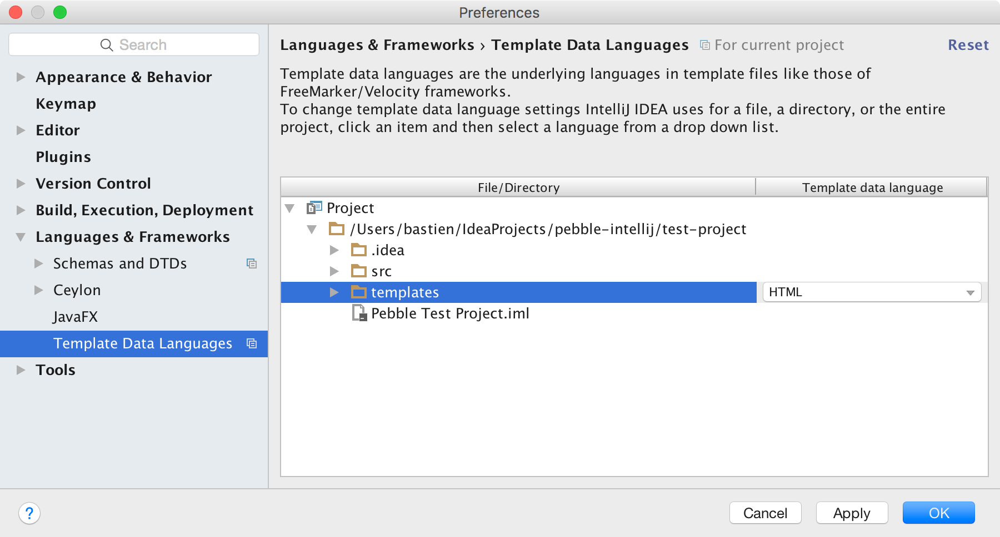

# IntelliJ plugin for Pebble  

This plugin provides support for the 
[Pebble templating engine](https://github.com/PebbleTemplates/pebble) in 
IntelliJ-based IDEs, including IntelliJ IDEA Community Edition. It supports
the IntelliJ platform version 143.x (IntelliJ IDEA 15, AppCode 3.3, CLion 1.2,
DataGrip 1.0, PhpStorm 10, PyCharm 5, RubyMine 8, WebStorm 11) and later.

  

## Features

* parser/lexer1 and syntax highlighter
* braces matching, code folding and commenting
* quote handler
* [more to come](https://github.com/bjansen/pebble-intellij/issues?utf8=%E2%9C%93&q=is%3Aissue%20is%3Aopen%20label%3At-feature)

1: *Custom extensions (tags, operators...), `verbatim` tags
and custom delimiters are currently not supported*.

## Installation

This plugin is available in JetBrains' [plugin repository](https://plugins.jetbrains.com/idea/plugin/9407-pebble),
from your IDE go to `Preferences > Plugins` and enter `pebble` in the search bar.

## Mixing Pebble and other languages

To make the editor recognize two languages in the same file, for example HTML 
and Pebble, go to `Preferences > Languages & Frameworks > Template Data Languages`
and select the `HTML` data language on the directory that contains your Pebble
templates:

